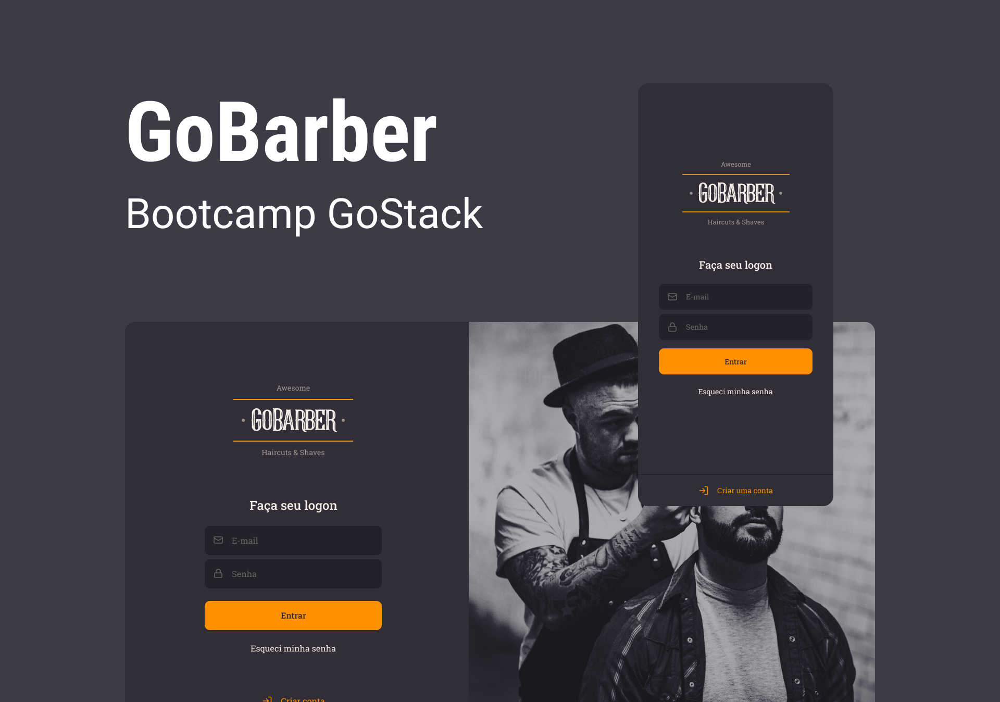
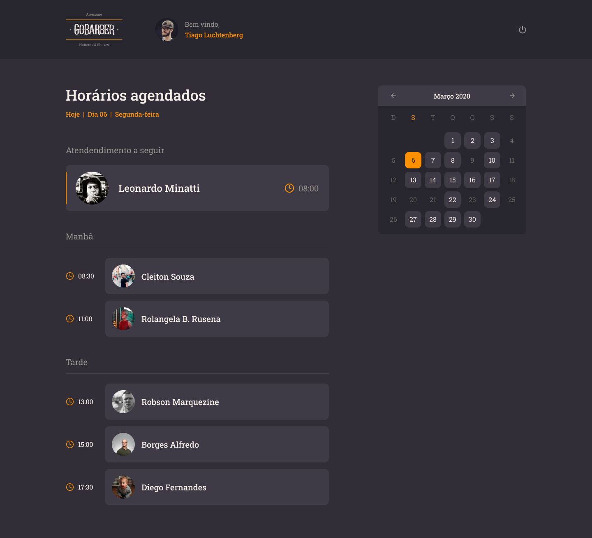
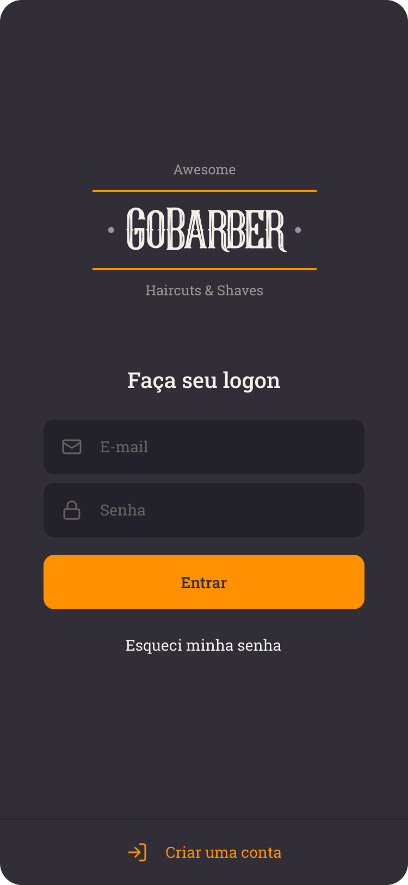
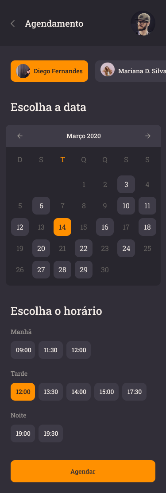

<h1 align="center">
    
</h1>

<p align="center">

  

  
	
  <a href="https://www.linkedin.com/in/cintiazago/">
    
  </a>

  <a href="https://github.com/cintiazago/gobarber/commits/master">
    
  </a>

  

</p>
<p align="center">

<a target="_blank" href="https://nodejs.org/">
    
  </a>

  <a href="https://reactjs.org/">
  
</a>

 <a href="https://reactnative.dev/">
    
  </a>
  </p>

## :page_with_curl: Sobre

Este repositório contém um API REST em Node.js como back-end, uma aplicação em ReactJS como front-end e um app mobile em React Native, todos utilizando TypeScript.

Essa é a aplicação GoBarber, que é uma plataforma de agendamento de serviços para proprietários de barbearias ou salões de beleza. Nessa aplicação o usuário consegue ter acesso a todos os prostadores de serviços cadastrados através de um aplicativo mobile, com isso usuário consegue escolher um prestador para marcar seu agendamento.

Já o prestador de serviço, através de um interface Web, consegue ter acesso a todos os seus horários, podendo ver todos os que estão ocupados quanto os que estão disponíveis.

**Node.js**: é uma API REST que faz todo o CRUD da aplicação, persistência de dados, tratativa de exceções e que serve dados tanto ao front-end quanto ao mobile.

**ReactJS**: é uma página Web no qual o prestador de serviço tem acesso a todo o seu calendário de agendamentos.

**React Native**: é um aplicativo em que o usuário tem acesso a todos os prestadores de serviço cadastrados no App, com isso ele pode fazer um agendamento que o prestador de preferência.

## 🎨 Layout

Design feito por [Tiago Luchtenberg](https://www.instagram.com/tiagoluchtenberg/)

<table>
  <tr>
    <td colspan="2"><h4 align="center">Desktop</h4> </td>
    <td colspan="2"><h4 align="center">Mobile</h4></td>
  </tr>
  <tr>
    <td></td><td></td>
    <td></td><td></td>
    <td></td>
  </tr>
</table>

## :books: Requisitos

- Ter [**Git**](https://git-scm.com/) para clonar o projeto.
- Ter [**Node.js**](https://nodejs.org/en/) instalado.
- Ter [**Docker**](https://www.docker.com/) rodando um container PostgreSQL.
- Um dispositivo ou emulador iOS ou Android

## :rocket: Começando

```bash
  # Clonar o projeto:
  $ git clone https://github.com/cintiazago/gobarber

  # Entrar no diretório:
  $ cd cintiazago/gobarber
```

## :gear: Iniciando back-end

```bash
  # Entrar no diretório do back-end:
  $ cd backend

  # Instalar as dependências:
  $ yarn

  # Rodar as migrations:
  $ yarn typeorm migration:run

  # Rodar a aplicação:
  $ yarn dev:server

  # O servidor inciará na porta:3333 - acesse http://localhost:3333
```

## :computer: Iniciando front-end

```bash
  # Entrar no diretório do front-end:
  $ cd web

  # Instalar as dependências:
  $ yarn

  # Rodar a aplicação:
  $ yarn start

  # A aplicação será aberta na porta:3000 - acesse http://localhost:3000
```

## :iphone: Iniciando mobile

```bash
  # Entrar no diretório do mobile:
  $ cd mobile

  # Instalar as dependências:
  $ yarn

  # Rodar a aplicação:
  $ yarn ios ou yarn android
```

## 🦸 Autora

<h4 align="center">

 <a href="https://www.linkedin.com/in/cintiazago" alt="LinkedIn" target="blank">
    
  </a>

  <a href="mailto:cintiazago@gmail.com?subject=Olá%20Cintia" alt="Email" target="blank">
    
  </a>

<br/>

Feito com ❤️ por Cintia Zago 👋🏽 [Entre em contato!](https://www.linkedin.com/in/cintiazago/)

</h4>